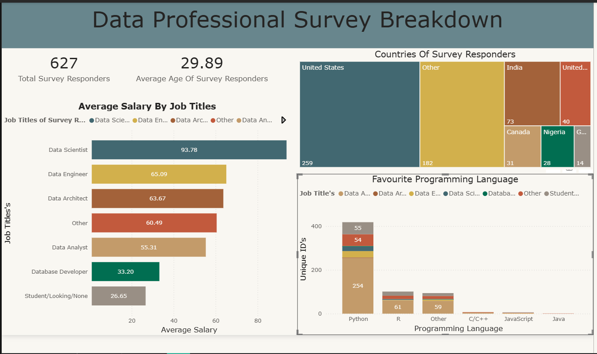

# Data Professional Survey Analysis (Power BI)

## Overview
This project presents an interactive Power BI dashboard analyzing survey responses from
data professionals across different roles, countries, and programming backgrounds.

## Tools & Technologies
- Power BI
- Power Query (Data Cleaning & Transformation)
- DAX (Calculated Measures)
- Excel Dataset

## Key Insights
- Data Scientists report the highest average salaries among surveyed roles.
- Salary satisfaction is relatively low compared to job satisfaction.
- Most respondents find breaking into data roles neither easy nor difficult.
- Majority of survey responses come from the United States.

## Dashboard Pages

- Total respondents and average age
- Average salary by job title
- Country-wise respondent distribution
- Favourite programming language and Corresponding Job Role of Survey Responders 

- Satisfaction with current role
- Happiness with current salary
- Difficulty level to break into data roles

## Dataset
Public Data Professional Survey dataset.

## Author
Abhay Sharma
